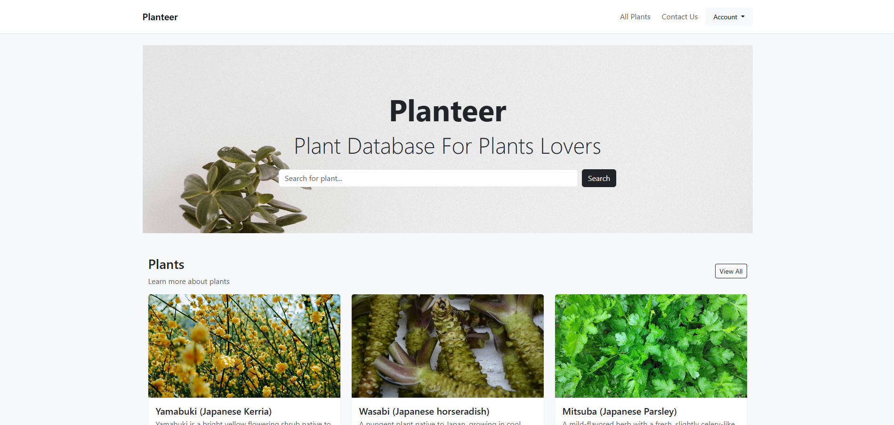
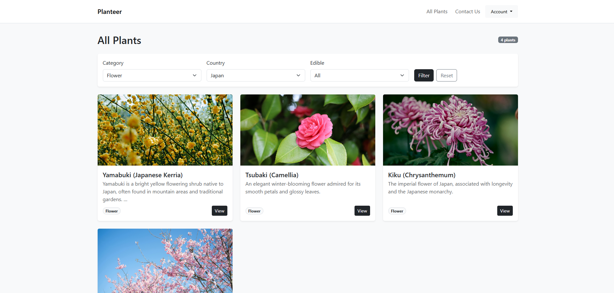

# Planteer

Planteer aims to be a minimal, easy-to-run reference implementation for a plant catalogue site with user profiles, image uploads and simple moderation features. It is built with Django and uses SQLite for development by default.

## Highlights

- Public listing of plants with optional grid/list views
- Plant detail page with related plants
- Search and filter plants by category, country, and edible status
- Image upload for plants and country flags
- Staff-only CRUD for adding/updating/deleting plants
- Per-plant comment system (authenticated users)
- User accounts with profile (avatar, bio, social media link)
- Contact form and contact message listing for admins
- Profanity filtering for comments (better-profanity)

## Screenshots





## Tech stack

- Python 3.11+ (tested with Python 3.x)
- Django 6.x
- SQLite (development)
- Pillow (image handling)
- better-profanity (comment filtering)
- Bootstrap 5 (front-end, via CDN)

## Project structure

- Planteer/ - Django project configuration (settings, urls, wsgi/asgi)
- accounts/ - custom user/profile views, templates
- main/ - homepage, contact form, site-wide templates
- plants/ - plant models, views, templates, media handling
- media/ - uploaded files (images, flags)
- static/ - CSS and client assets
- requirements.txt - Python dependencies

## Requirements

- Python 3.11+ (or recent 3.x)
- pip
- Recommended: a virtual environment (venv, virtualenv)

## Quick start

Follow these steps to get the project running locally for development.

1. Clone the repository

```bash
git clone https://github.com/FadhelAlmalki/planteer.git
cd planteer
```

2. Create & activate a virtual environment

Windows (PowerShell):

```powershell
python -m venv venv
.\venv\Scripts\Activate.ps1
```

macOS / Linux:

```bash
python3 -m venv venv
source venv/bin/activate
```

3. Install dependencies

```bash
pip install -r requirements.txt
```

4. Change into the Django project directory and apply migrations

```bash
cd Planteer
python manage.py migrate
```

5. (Optional) Create a superuser

```bash
python manage.py createsuperuser
```

6. Run the local dev server

```bash
python manage.py runserver
```

Open http://127.0.0.1:8000/ in your browser.